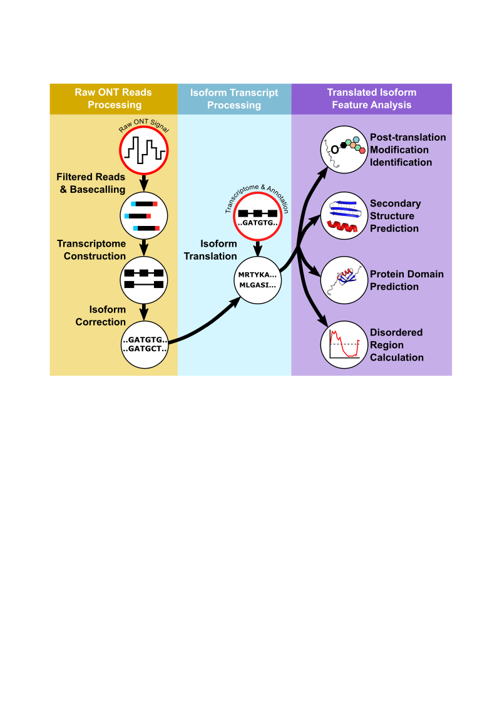

# Modules Overview

Though the IsoTV is composed of three parts, it can be split into two smaller workflows which can be run independently or together.

The main workflow outputs a visualization of the feature analysis of translated isoforms from an input list of genes. A wide range of sequencing data inputs in valid, as long at least an transcriptome file and an annotation file is provided. A quantification file can also be provided for isoform quantification.

A secondary workflow is optional and can be used if the user has raw ONT singal or basecalled ONT reads. This processes the long-reads, *de novo* assembles a transcriptome, remaps reads to this transcriptome, and quantifies isoform expression levels.

Below is the general scheme of the IsoTV pipeline.

