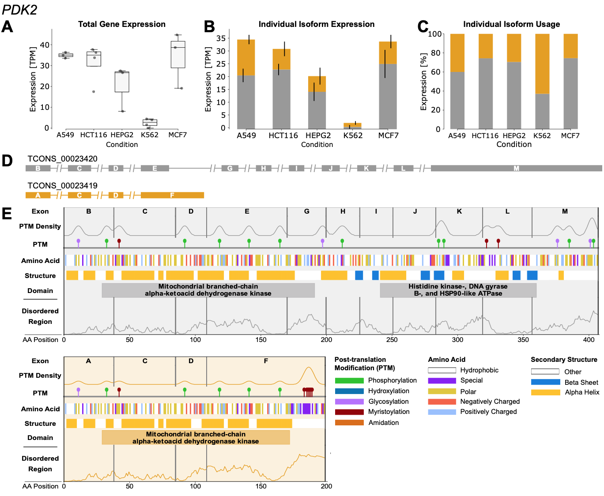

# Visualization

The final NanoIso step is producing a visualization incorporating all of the functional features for each individual isoform. The report is generated for each gene, and if specified, also for the group of input genes. An example of the report is shown and explained below.



* The first section contains the quantification of gene and expression values. The first plot shows the total gene expression, the second plot shows individual isoform expression, and the third plot shows individual isoform usage. Expression is calculated in TPM for if using the ONT Processing pipeline.

* The second section visualizes the annotation for all transcripts. Each exon has also been uniquely annotated by NanoIso - If the exon from one transcript exactly matches the exon to another transcript, then they will classified the same. Note - Regardless of strand direction, every transcript is visualized left to right.

* The third visualizes the various translational analysis. Each plot for each isoform has 7 different subparts.
    1. Exon - Exon boundary, numbering, and annotation as described above.
    2. PTM Den - The density of post-translation modification sites predicted using Prosite.
    2. PTM - The locations of 5 common PTMs (phosphorylation, hydroxylation, glycolysation, myristoylation, and amidation).
    3. SS - Secondary structure predicted using Porter. Categorized regions into alpha sheets, beta helix, or other.
    4. AA - Amino acid base, color coded by hydrophobic, polar, negatively charged, postively charged, and special/other.
    6. Domain - Protein domains predicted using Pfam and InterProScan.
    7. Disorder - Score of regions of disorder, with 1 being highly disorder and 0 having low disorder.

* The last section contains the legend for the translation analysis plots in the previous group.

## Usage

Input -
```
/Genes/GENE/Transcripts/x_protein.fa
/Genes/GENE/Transcripts/x_protein.fa.ss3
/Genes/GENE/Transcripts/x_prion_score.txt
/Genes/GENE/Transcripts/x_protein_iupred2a.txt
/Genes/GENE/Transcripts/x_protein_sites.txt
/Genes/GENE/Transcripts/x_protein.gff3
```

Output - `/Genes/GENE/transcripts_filtered_coding_potential_analysis.pdf`

## Configuration

`output_plots: "test.pdf"` - An output file to create a pdf of all individual reports.

`output_seqs: "test/"` - An output folder to store the protein sequences for each transcript for each gene.

## Output Folder Structure

```
| -- Genes/
    | -- GENE/
        | -- GENE_transcripts_filtered_analysis.txt
        | -- Transcripts/
            | -- x_protein_analysis.txt
            ...
    ...
| -- test.pdf
```
